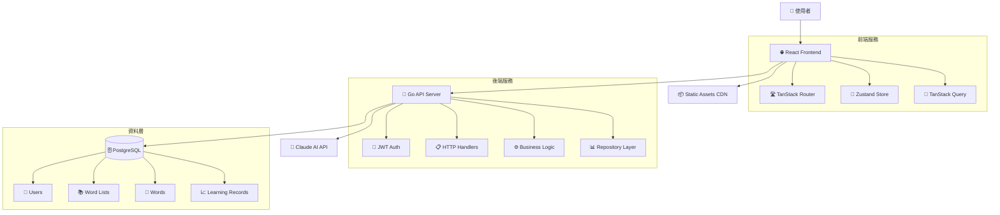
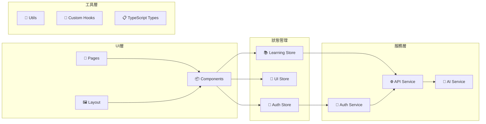
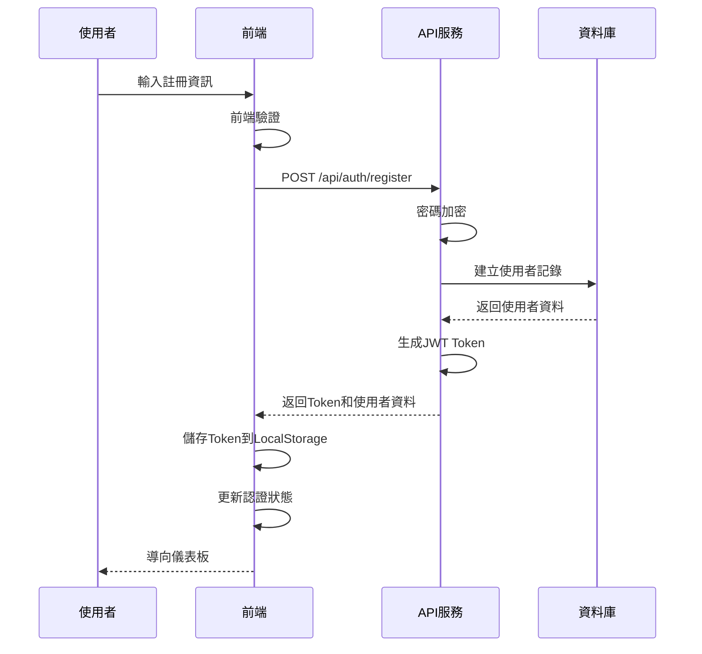
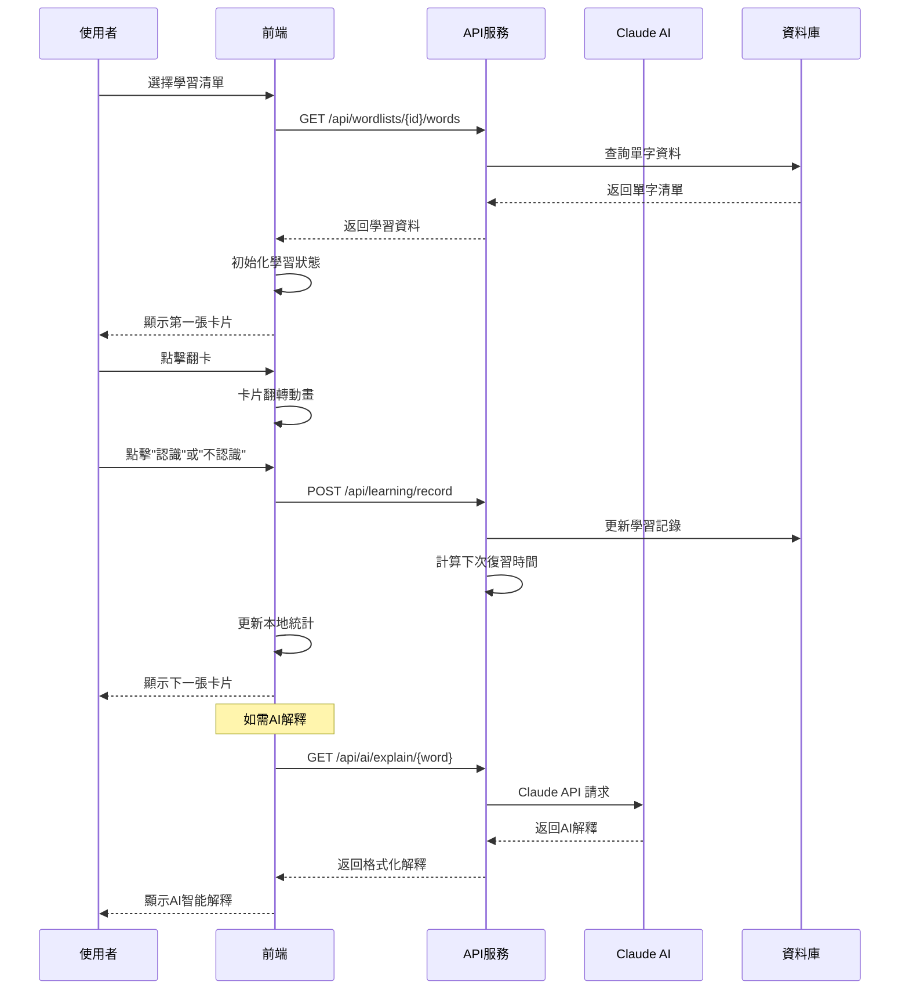
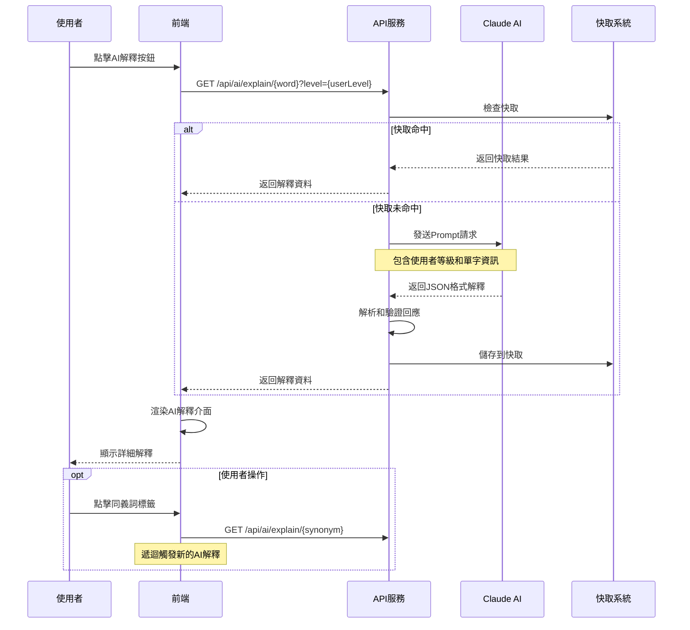
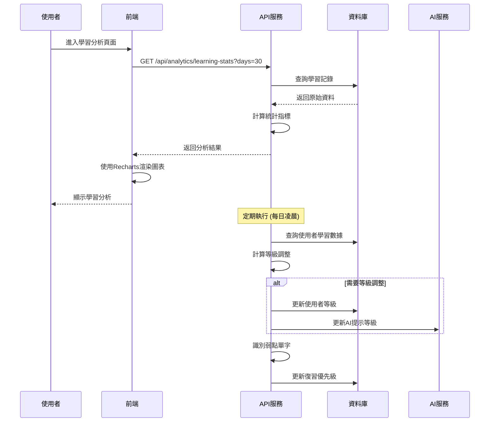

# Smart Learning 系統功能分析報告

## 📋 專案概述

Smart Learning 是一個智能英語學習平台，結合現代前端技術、後端API服務和AI人工智慧，為使用者提供個人化的英語學習體驗。

### 技術架構
- **前端**: React + TypeScript + TailwindCSS + Vite
- **後端**: Go + Gin + PostgreSQL
- **AI服務**: Claude Haiku API
- **資料庫**: Supabase (PostgreSQL)
- **部署**: Vercel (前端) + Railway (後端)

---

## 🎯 核心功能模組分析

### 1. 使用者認證系統

#### 功能詳細說明
- **使用者註冊**: 電子郵件 + 密碼註冊，支援學習等級選擇
- **使用者登入**: JWT Token 認證，維持登入狀態
- **設定檔管理**: 修改個人資料、學習等級調整
- **權限控制**: 未登入用戶自動導向登入頁面

#### 頁面交互與按鈕功能

**登入頁面 (LoginForm.tsx)**
```
📍 頁面元素:
├── 電子郵件輸入框 → 觸發表單驗證
├── 密碼輸入框 → 觸發密碼強度檢查
├── [登入] 按鈕 → 觸發 login() 函數
│   ├── 發送 POST /api/auth/login
│   ├── 驗證成功 → 儲存JWT Token
│   ├── 更新 Zustand 認證狀態
│   └── 導向到 Dashboard 頁面
├── [註冊] 連結 → 導向註冊頁面
└── [忘記密碼] 連結 → 導向密碼重設頁面
```

**註冊頁面 (RegisterForm.tsx)**
```
📍 頁面元素:
├── 使用者名稱輸入框 → 即時驗證名稱可用性
├── 電子郵件輸入框 → 驗證電子郵件格式
├── 密碼輸入框 → 密碼強度即時檢查
├── 確認密碼輸入框 → 密碼一致性驗證
├── 學習等級選擇器 → 初始化學習等級 (1-5)
├── [註冊] 按鈕 → 觸發 register() 函數
│   ├── 發送 POST /api/auth/register
│   ├── 建立使用者帳號
│   ├── 自動登入並儲存 Token
│   └── 導向到歡迎頁面
└── [已有帳號] 連結 → 導向登入頁面
```

### 2. 學習清單管理

#### 功能詳細說明
- **清單CRUD**: 建立、編輯、刪除學習清單
- **單字管理**: 清單內單字的新增、修改、刪除
- **分享功能**: 生成分享碼，公開學習清單
- **匯入匯出**: 支援多種格式的清單資料處理

#### 頁面交互與按鈕功能

**清單管理頁面 (WordListCard.tsx)**
```
📍 單字清單卡片:
├── 清單標題 → 點擊進入清單詳情
├── 清單描述 → 顯示清單簡介
├── 單字數量統計 → 動態更新
├── [編輯] 按鈕 → 觸發 onEdit(wordList.id)
│   ├── 開啟編輯模態框
│   ├── 載入原有資料
│   └── 更新清單資訊
├── [分享] 按鈕 → 觸發 onShare(wordList.id)
│   ├── 生成分享碼
│   ├── 顯示分享連結
│   └── 複製到剪貼簿功能
├── [刪除] 按鈕 → 觸發 onDelete(wordList.id)
│   ├── 顯示確認對話框
│   ├── 確認後發送 DELETE /api/wordlists/{id}
│   └── 更新清單顯示
└── [開始學習] 按鈕 → 導向圖卡學習模式
```

**新增清單表單 (WordListForm.tsx)**
```
📍 表單元素:
├── 清單名稱輸入框 → 必填驗證
├── 清單描述輸入框 → 可選填
├── 公開設定開關 → 控制清單可見性
├── [建立清單] 按鈕 → 觸發 createWordList()
│   ├── 發送 POST /api/wordlists
│   ├── 返回新建清單ID
│   └── 導向清單編輯頁面
└── [取消] 按鈕 → 關閉表單，返回清單頁面
```

### 3. 圖卡學習模式

#### 功能詳細說明
- **翻卡介面**: 3D翻轉效果的學習卡片
- **進度追蹤**: 即時顯示學習進度和正確率
- **間隔重複演算法**: 根據學習表現調整復習頻率
- **學習統計**: 記錄答對/答錯次數

#### 頁面交互與按鈕功能

**翻卡學習介面 (FlashCard.tsx)**
```
📍 學習介面:
├── 進度條 → 顯示當前進度 (currentIndex/totalWords)
├── 正確率顯示 → 即時計算並顯示
├── 翻卡容器 → 點擊卡片觸發 onFlip()
│   ├── 正面: 顯示單字和發音
│   └── 背面: 顯示定義和例句
├── [不認識] 按鈕 → 觸發 onIncorrect()
│   ├── incorrectCount +1
│   ├── 更新學習記錄
│   ├── 調整下次復習時間 (縮短)
│   └── 載入下一張卡片
├── [認識] 按鈕 → 觸發 onCorrect()
│   ├── correctCount +1
│   ├── 更新學習記錄
│   ├── 調整下次復習時間 (延長)
│   └── 載入下一張卡片
├── [上一個] 按鈕 → currentIndex-1
├── [下一個] 按鈕 → currentIndex+1
└── [結束學習] 按鈕 → 顯示學習結果頁面
```

**學習結果頁面 (ResultModal.tsx)**
```
📍 結果統計:
├── 學習時間統計 → 總學習時長
├── 答題統計 → 正確/錯誤題數
├── 正確率圖表 → 視覺化學習成果
├── 需要複習的單字清單 → 錯誤率高的單字
├── [再學一次] 按鈕 → 重新開始相同清單
├── [選擇其他清單] 按鈕 → 返回清單選擇
└── [查看詳細分析] 按鈕 → 導向分析頁面
```

### 4. AI 智能回應

#### 功能詳細說明
- **多樣化解釋**: 根據使用者等級調整說明複雜度
- **同義詞推薦**: AI生成相關詞彙
- **詞根分析**: 詞根家族和相關詞彙
- **記憶法生成**: 創意記憶技巧和口訣

#### 頁面交互與按鈕功能

**AI解釋介面 (AIExplanation.tsx)**
```
📍 AI回應區塊:
├── AI標識 → 智能解釋識別標誌
├── 詳細定義區 → 根據使用者等級調整語言難度
├── 同義詞標籤群 → 點擊標籤可查看該詞解釋
├── 反義詞標籤群 → 點擊標籤可查看該詞解釋
├── 詞根家族分析 → 相關詞彙連結
├── 記憶技巧卡片 → 創意記憶法和口訣
├── 例句示範區 → 情境化例句與中文翻譯
├── [重新生成] 按鈕 → 觸發新的AI解釋
├── [加入單字卡] 按鈕 → 將AI內容加入學習清單
└── [語音朗讀] 按鈕 → TTS語音播放
```

### 5. 等級化學習

#### 功能詳細說明
- **自適應等級**: 根據學習表現自動調整使用者等級
- **內容難度調整**: 不同等級顯示相應複雜度的內容
- **個人化建議**: 基於等級的學習路徑推薦

#### 等級系統詳細說明
```
等級1 (初學者): 1000-2000 常用詞彙，簡單文法
等級2 (初級): 2000-3000 詞彙，基礎文法結構  
等級3 (中級): 3000-5000 詞彙，中等文法複雜度
等級4 (中高級): 5000-8000 詞彙，進階文法
等級5 (高級): 8000+ 詞彙，學術/專業詞彙
```

**等級調整機制**
```
升級條件: 正確率 ≥ 85% + 日均學習時間 ≥ 15分鐘
降級條件: 正確率 < 40% (避免挫折感)
調整頻率: 每30天自動評估一次
```

### 6. 學習追蹤與分析

#### 功能詳細說明
- **學習數據視覺化**: 使用Recharts顯示學習趨勢
- **弱點分析**: 識別需要加強的單字
- **學習習慣分析**: 學習時間、頻率統計

#### 頁面交互與按鈕功能

**分析儀表板 (LearningChart.tsx)**
```
📍 分析圖表:
├── 時間範圍選擇器 → [週] [月] [年] 切換顯示
├── 學習進度線圖 → 正確率、新學單字數趨勢
├── 學習時間統計 → 日/週/月學習時長
├── 總答題數統計 → 累計學習量
├── 平均正確率 → 學習效果指標
├── 弱點單字清單 → 正確率 < 60% 的單字
│   └── 點擊單字 → 進入該單字的AI解釋
├── [匯出報告] 按鈕 → 生成PDF學習報告
├── [設定學習目標] 按鈕 → 開啟目標設定頁面
└── [學習提醒設定] 按鈕 → 配置推送通知
```

### 7. 搜尋與篩選

#### 功能詳細說明
- **多維度搜尋**: 關鍵字、難度、掌握程度篩選
- **智能排序**: 多種排序方式組合
- **快速搜尋**: Ctrl+K 快捷鍵

#### 頁面交互與按鈕功能

**搜尋篩選器 (SearchFilter.tsx)**
```
📍 篩選介面:
├── 關鍵字搜尋框 → 即時搜尋單字和定義
├── 難度等級下拉選單 → [全部] [初學者] [初級] [中級] [中高級] [高級]
├── 掌握程度選擇器 → [全部] [未學習] [學習中] [熟悉] [已掌握]
├── 排序方式選擇器 → [最新建立] [字母順序] [難度] [正確率]
├── [搜尋] 按鈕 → 觸發 onSearch(searchParams)
│   ├── 發送 GET /api/words/search
│   ├── 更新搜尋結果顯示
│   └── 更新URL參數
├── [重置] 按鈕 → 清空所有篩選條件
└── 快捷鍵提示 → Ctrl+K 開啟快速搜尋
```

---

## 🏗️ 系統架構圖

### 整體架構


### 前端架構詳細圖


---

## 🔄 系統主要業務流程圖

### 1. 使用者註冊登入流程


### 2. 圖卡學習流程


### 3. AI智能解釋生成流程


### 4. 學習數據分析流程


---

## 📱 詳細頁面功能說明

### 主要頁面結構
```
📱 Smart Learning App
├── 🔐 認證頁面
│   ├── 登入頁面 (/login)
│   ├── 註冊頁面 (/register)  
│   └── 忘記密碼 (/forgot-password)
├── 🏠 儀表板 (/dashboard)
│   ├── 學習進度總覽
│   ├── 快速開始學習
│   ├── 最近學習清單
│   └── 學習統計摘要
├── 📚 學習清單管理 (/wordlists)
│   ├── 清單總覽頁面
│   ├── 清單詳情頁面 (/wordlists/{id})
│   ├── 新增/編輯清單 (/wordlists/new, /wordlists/{id}/edit)
│   └── 分享清單頁面 (/wordlists/{id}/share)
├── 🎴 圖卡學習 (/learning)
│   ├── 清單選擇頁面 (/learning/select)
│   ├── 學習介面 (/learning/{listId})
│   └── 學習結果 (/learning/{listId}/result)
├── 🤖 AI智能功能 (/ai)
│   ├── 單字AI解釋 (/ai/word/{word})
│   └── 學習建議 (/ai/recommendations)
├── 📊 學習分析 (/analytics)
│   ├── 進度分析 (/analytics/progress)
│   ├── 弱點分析 (/analytics/weakwords)
│   └── 學習報告 (/analytics/reports)
├── 🔍 搜尋功能 (/search)
│   ├── 快速搜尋 (Ctrl+K)
│   └── 進階搜尋 (/search/advanced)
└── ⚙️ 設定頁面 (/settings)
    ├── 個人資料 (/settings/profile)
    ├── 學習偏好 (/settings/learning)
    └── 通知設定 (/settings/notifications)
```

### 關鍵互動流程

#### 快速學習流程
```
1. 使用者進入儀表板
2. 點擊"快速學習"按鈕
3. 系統自動選擇需要復習的單字清單
4. 進入圖卡學習模式
5. 完成學習後顯示結果統計
6. 可選擇繼續學習或返回儀表板
```

#### AI輔助學習流程  
```
1. 學習過程中遇到困難單字
2. 點擊"AI解釋"按鈕
3. 系統根據使用者等級生成個人化解釋
4. 顯示同義詞、反義詞、詞根分析
5. 提供記憶技巧和例句
6. 可將AI內容加入個人筆記
```

#### 自適應學習調整流程
```
1. 系統每日分析使用者學習資料
2. 計算正確率、學習時間等指標
3. 判斷是否需要調整學習等級
4. 自動更新AI解釋複雜度
5. 推薦適合的學習內容
6. 通知使用者等級變化
```

---

## 🔧 技術實作細節

### 前端狀態管理
```typescript
// 認證狀態管理
interface AuthState {
  user: User | null
  token: string | null
  isAuthenticated: boolean
  login: (email: string, password: string) => Promise<void>
  logout: () => void
}

// 學習狀態管理  
interface LearningState {
  currentWordList: WordList | null
  currentWordIndex: number
  learningStats: LearningStats
  updateStats: (correct: boolean) => void
}
```

### 後端API設計
```go
// RESTful API 端點
GET    /api/auth/me
POST   /api/auth/login
POST   /api/auth/register

GET    /api/wordlists
POST   /api/wordlists
GET    /api/wordlists/{id}
PUT    /api/wordlists/{id}
DELETE /api/wordlists/{id}

POST   /api/learning/record
GET    /api/learning/stats
GET    /api/learning/weak-words

POST   /api/ai/explain
GET    /api/ai/recommendations
```

### 資料庫設計關鍵表結構
```sql
-- 學習記錄表 (關鍵業務邏輯)
CREATE TABLE learning_records (
    id SERIAL PRIMARY KEY,
    user_id INTEGER REFERENCES users(id),
    word_id INTEGER REFERENCES words(id),
    correct_count INTEGER DEFAULT 0,
    incorrect_count INTEGER DEFAULT 0,
    last_studied_at TIMESTAMP,
    next_review_at TIMESTAMP,  -- 間隔重複演算法
    mastery_level INTEGER DEFAULT 0,  -- 掌握程度 0-5
    created_at TIMESTAMP DEFAULT CURRENT_TIMESTAMP
);
```

---

## 📈 核心演算法

### 間隔重複演算法 (Spaced Repetition)
```typescript
function calculateNextReview(correctCount: number, incorrectCount: number): Date {
  const accuracy = correctCount / (correctCount + incorrectCount)
  let intervalDays: number
  
  if (accuracy >= 0.9) {
    intervalDays = Math.min(30, Math.pow(2, Math.floor(correctCount / 3)))
  } else if (accuracy >= 0.7) {
    intervalDays = Math.min(7, Math.pow(1.5, Math.floor(correctCount / 2)))
  } else {
    intervalDays = 1 // 每天復習
  }
  
  const nextReview = new Date()
  nextReview.setDate(nextReview.getDate() + intervalDays)
  return nextReview
}
```

### 自適應等級調整
```go
func (s *AdaptiveLearningService) calculateNewLevel(stats *LearningStats, currentLevel int) int {
    accuracy := float64(stats.CorrectAnswers) / float64(stats.TotalAnswers)
    avgStudyTime := stats.TotalStudyTime / stats.StudyDays

    // 升級條件: 正確率≥85% && 日均學習≥15分鐘
    if accuracy >= 0.85 && avgStudyTime >= 15*60 && currentLevel < 5 {
        return currentLevel + 1
    }

    // 降級條件: 正確率<40% (避免挫折)
    if accuracy < 0.4 && currentLevel > 1 {
        return currentLevel - 1
    }

    return currentLevel
}
```

---

## 🎯 總結

Smart Learning 系統通過精心設計的七大功能模組，提供了完整的英語學習體驗：

1. **🔐 認證系統** - 安全的使用者管理和權限控制
2. **📚 清單管理** - 靈活的學習內容組織和分享
3. **🎴 圖卡學習** - 科學的間隔重複學習方式
4. **🤖 AI智能** - 個人化的學習輔助和解釋
5. **📊 等級化** - 自適應的難度調整機制
6. **📈 數據分析** - 詳細的學習進度追蹤
7. **🔍 搜尋篩選** - 高效的內容查找功能

系統採用現代化的技術架構，確保了良好的使用者體驗和系統可維護性。通過AI技術的深度整合和科學的學習演算法，為使用者提供真正個人化和高效的英語學習環境。