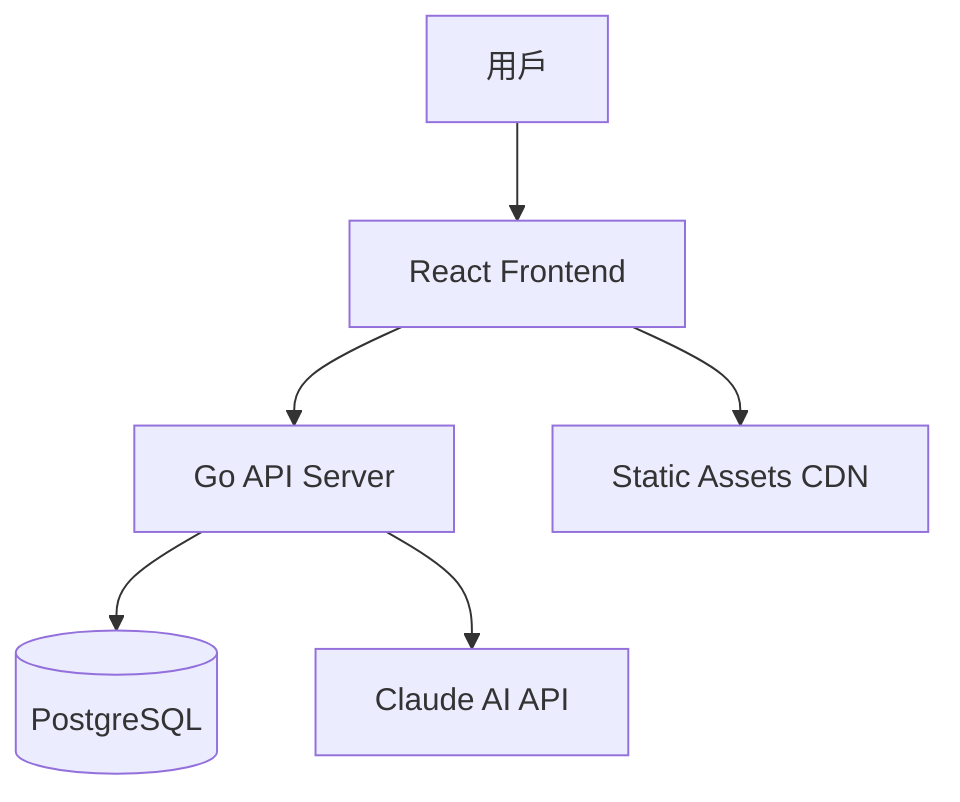
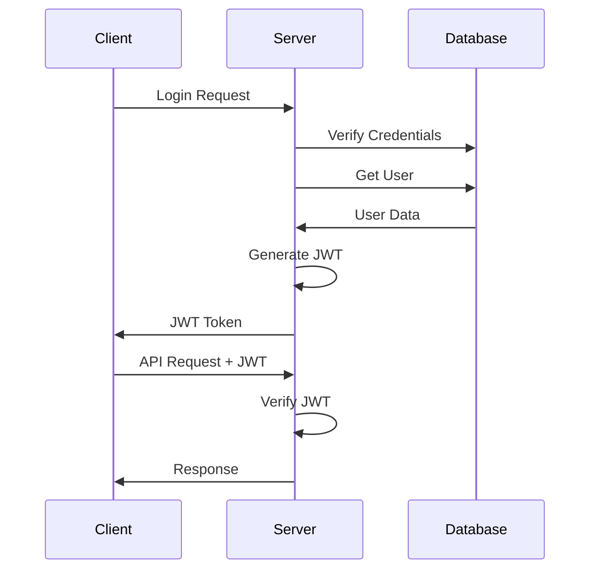
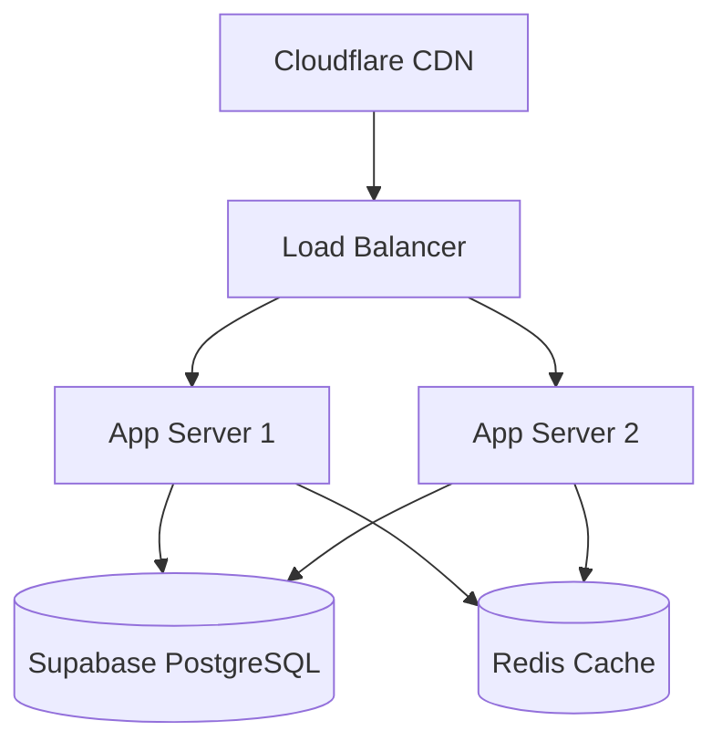

# Smart Learning 技術架構文檔

## 系統架構概覽

Smart Learning 採用現代前後端分離架構，結合雲端服務和 AI 技術，提供高效能、可擴展的英語學習平台。



## 前端架構

### 技術棧

| 技術 | 版本 | 用途 |
|------|------|------|
| **Vite** | Latest | 建構工具，提供快速開發體驗 |
| **React** | Latest | UI 框架，組件化開發 |
| **TypeScript** | Latest | 型別安全，提升開發效率 |
| **TailwindCSS** | Latest | 實用優先的 CSS 框架 |
| **Shadcn UI** | Latest | 高品質 UI 組件庫 |
| **TanStack Query** | Latest | 伺服器狀態管理 |
| **Zustand** | Latest | 客戶端狀態管理 |
| **TanStack Router** | Latest | 類型安全的路由系統 |
| **React Hook Form** | Latest | 高效能表單處理 |
| **Vitest** | Latest | 單元測試框架 |

### 專案結構

```
src/
├── components/              # 可重用組件
│   └── ui/                 # 基礎 UI 組件 (Shadcn UI)
│       ├── button.tsx
│       ├── input.tsx
│       ├── dialog.tsx
│       └── sonner.tsx
├── features/               # 功能模組化架構
│   ├── auth/              # 認證功能模組
│   │   ├── components/    # 認證相關組件
│   │   │   ├── AuthFormContainer.tsx
│   │   │   ├── AuthHeader.tsx
│   │   │   ├── AuthLayout.tsx
│   │   │   ├── ForgotPasswordButton.tsx
│   │   │   ├── LoginButton.tsx
│   │   │   ├── LoginForm.tsx
│   │   │   ├── RegisterButton.tsx
│   │   │   └── index.ts
│   │   └── pages/         # 認證頁面
│   │       └── LoginPage.tsx
│   └── dashboard/         # 儀表板功能模組
│       └── pages/
│           └── DashboardPage.tsx
├── hooks/                  # 自定義 Hooks (依功能分組)
│   └── auth/              # 認證相關 Hooks
│       ├── useAuth.ts
│       └── useLoginForm.ts
├── lib/                    # 共用函式庫
│   └── utils.ts           # 工具函數 (含 cn 函數)
├── providers/              # Context Providers
│   └── AppProviders.tsx   # 應用程式 Providers 包裝
├── routes/                 # 路由配置 (TanStack Router)
│   ├── index.tsx          # 路由定義
│   └── routeTree.tsx      # 路由樹生成
├── services/               # API 服務
│   └── authService.ts     # 認證 API 服務
├── stores/                 # 狀態管理 (Zustand)
│   └── authStore.ts       # 認證狀態管理
├── test/                   # 測試配置
│   └── setup.ts           # 測試環境設定
├── types/                  # TypeScript 類型定義
│   └── auth.ts            # 認證相關類型
├── assets/                 # 靜態資源
│   └── react.svg          # React Logo
├── App.tsx                 # 主應用程式組件
├── App.css                 # 應用程式樣式
├── main.tsx                # 應用程式入口點
├── index.css               # 全域樣式
└── vite-env.d.ts          # Vite 環境類型
```

### 狀態管理策略

#### 伺服器狀態 (TanStack Query)
```typescript
// 用於 API 資料快取和同步
const useWordLists = () => {
  return useQuery({
    queryKey: ['wordLists'],
    queryFn: () => wordService.getWordLists(),
    staleTime: 5 * 60 * 1000, // 5 分鐘
    gcTime: 10 * 60 * 1000,   // 10 分鐘
  })
}
```

#### 客戶端狀態 (Zustand)
```typescript
// 用於應用程式本地狀態
interface UIStore {
  theme: 'light' | 'dark'
  sidebarOpen: boolean
  setTheme: (theme: 'light' | 'dark') => void
  toggleSidebar: () => void
}
```

### 路由架構
```typescript
// 使用 TanStack Router 進行類型安全路由
const routeTree = createRootRoute({
  component: RootLayout,
}).addChildren([
  createRoute({
    getParentRoute: () => routeTree,
    path: '/login',
    component: LoginPage,
  }),
  createRoute({
    getParentRoute: () => routeTree,
    path: '/',
    component: DashboardPage,
    beforeLoad: ({ context }) => {
      // 未登入用戶強制導向登入頁面
      if (!context.auth.isAuthenticated) {
        throw redirect({ to: '/login' })
      }
    },
  }),
  createRoute({
    getParentRoute: () => routeTree,
    path: '/dashboard',
    component: DashboardPage,
    beforeLoad: ({ context }) => {
      if (!context.auth.isAuthenticated) {
        throw redirect({ to: '/login' })
      }
    },
  }),
])
```

## 後端架構

### 技術棧

| 技術 | 版本 | 用途 |
|------|------|------|
| **Go** | Latest | 高效能後端語言 |
| **Gin** | Latest | 輕量級 Web 框架 |
| **PostgreSQL** | Latest | 主要資料庫 |
| **Supabase** | Latest | 資料庫託管服務 |
| **JWT** | Latest | 使用者認證 |
| **Testify** | Latest | 測試框架 |
| **Migrate** | Latest | 資料庫遷移工具 |

### 專案結構

```
internal/
├── config/                 # 配置管理
│   └── config.go
├── handlers/               # HTTP 處理器
│   ├── auth.go
│   ├── users.go
│   ├── words.go
│   └── learning.go
├── services/               # 業務邏輯
│   ├── auth_service.go
│   ├── user_service.go
│   ├── word_service.go
│   ├── ai_service.go
│   └── learning_service.go
├── models/                 # 資料模型
│   ├── user.go
│   ├── word.go
│   ├── word_list.go
│   └── learning_record.go
├── repository/             # 資料存取層
│   ├── interfaces.go
│   ├── user_repo.go
│   ├── word_repo.go
│   └── learning_repo.go
├── middleware/             # 中間件
│   ├── auth.go
│   ├── cors.go
│   └── logger.go
├── utils/                  # 工具函數
│   ├── jwt.go
│   ├── password.go
│   └── validation.go
└── server/                 # 伺服器設定
    └── server.go
```

### 分層架構

#### 1. Handler 層 (HTTP 處理)
```go
func (h *WordHandler) CreateWordList(c *gin.Context) {
    var req CreateWordListRequest
    if err := c.ShouldBindJSON(&req); err != nil {
        c.JSON(400, gin.H{"error": err.Error()})
        return
    }
    
    userID := getUserID(c)
    wordList, err := h.wordService.CreateWordList(userID, req)
    if err != nil {
        c.JSON(500, gin.H{"error": err.Error()})
        return
    }
    
    c.JSON(201, wordList)
}
```

#### 2. Service 層 (業務邏輯)
```go
func (s *WordService) CreateWordList(userID int, req CreateWordListRequest) (*models.WordList, error) {
    // 驗證資料
    if err := s.validateWordList(req); err != nil {
        return nil, err
    }
    
    // 建立資料
    wordList := &models.WordList{
        UserID:      userID,
        Name:        req.Name,
        Description: req.Description,
    }
    
    return s.wordRepo.Create(wordList)
}
```

#### 3. Repository 層 (資料存取)
```go
func (r *WordRepository) Create(wordList *models.WordList) (*models.WordList, error) {
    query := `
        INSERT INTO word_lists (user_id, name, description, created_at) 
        VALUES ($1, $2, $3, NOW()) 
        RETURNING id, created_at`
        
    err := r.db.QueryRow(query, wordList.UserID, wordList.Name, wordList.Description).
        Scan(&wordList.ID, &wordList.CreatedAt)
        
    return wordList, err
}
```

### 資料庫設計

#### 核心表結構

```sql
-- 使用者表
CREATE TABLE users (
    id SERIAL PRIMARY KEY,
    email VARCHAR(255) UNIQUE NOT NULL,
    username VARCHAR(100) UNIQUE NOT NULL,
    password_hash VARCHAR(255),
    learning_level INTEGER DEFAULT 1,
    avatar_url VARCHAR(500),
    created_at TIMESTAMP DEFAULT CURRENT_TIMESTAMP,
    updated_at TIMESTAMP DEFAULT CURRENT_TIMESTAMP
);

-- 單字清單表
CREATE TABLE word_lists (
    id SERIAL PRIMARY KEY,
    user_id INTEGER REFERENCES users(id) ON DELETE CASCADE,
    name VARCHAR(200) NOT NULL,
    description TEXT,
    is_public BOOLEAN DEFAULT FALSE,
    created_at TIMESTAMP DEFAULT CURRENT_TIMESTAMP,
    updated_at TIMESTAMP DEFAULT CURRENT_TIMESTAMP
);

-- 單字表
CREATE TABLE words (
    id SERIAL PRIMARY KEY,
    word_list_id INTEGER REFERENCES word_lists(id) ON DELETE CASCADE,
    word VARCHAR(100) NOT NULL,
    pronunciation VARCHAR(200),
    definition TEXT NOT NULL,
    example_sentence TEXT,
    difficulty_level INTEGER DEFAULT 1,
    created_at TIMESTAMP DEFAULT CURRENT_TIMESTAMP
);

-- 學習記錄表
CREATE TABLE learning_records (
    id SERIAL PRIMARY KEY,
    user_id INTEGER REFERENCES users(id) ON DELETE CASCADE,
    word_id INTEGER REFERENCES words(id) ON DELETE CASCADE,
    correct_count INTEGER DEFAULT 0,
    incorrect_count INTEGER DEFAULT 0,
    last_studied_at TIMESTAMP,
    mastery_level INTEGER DEFAULT 0,
    created_at TIMESTAMP DEFAULT CURRENT_TIMESTAMP,
    updated_at TIMESTAMP DEFAULT CURRENT_TIMESTAMP
);
```

## AI 服務整合

### Claude API 整合
```go
type AIService struct {
    client *http.Client
    apiKey string
    baseURL string
}

func (s *AIService) GenerateExplanation(word string, userLevel int) (*AIResponse, error) {
    prompt := fmt.Sprintf(`
        為英語學習者解釋單字 "%s"，使用者等級：%d
        請提供：
        1. 詳細定義
        2. 同義詞和反義詞
        3. 詞根分析
        4. 記憶法
        5. 例句（根據等級調整難度）
    `, word, userLevel)
    
    return s.sendRequest(prompt)
}
```

### AI 功能應用
- **個人化解釋**：根據使用者等級調整說明複雜度
- **智能推薦**：分析學習記錄推薦相關單字
- **記憶法生成**：AI 生成創意記憶技巧
- **例句生成**：情境化例句幫助理解

## 認證與授權

### JWT 認證流程


### 權限控制
```go
func AuthMiddleware() gin.HandlerFunc {
    return func(c *gin.Context) {
        token := extractToken(c)
        claims, err := validateJWT(token)
        if err != nil {
            c.JSON(401, gin.H{"error": "Unauthorized"})
            c.Abort()
            return
        }
        
        c.Set("userID", claims.UserID)
        c.Next()
    }
}
```

## 效能優化策略

### 前端優化
- **程式碼分割**：路由層級的懶載入
- **圖片優化**：WebP 格式，響應式載入
- **快取策略**：API 資料快取，離線支援
- **Bundle 優化**：Tree shaking，動態導入

### 後端優化
- **資料庫索引**：查詢效能優化
- **連線池**：資料庫連線管理
- **快取層**：Redis 快取熱點資料
- **API 限流**：防止濫用

## 部署架構

### 生產環境


### 環境配置
- **開發環境**：本地開發，即時重載
- **測試環境**：CI/CD 自動部署

## 監控與日誌

### 應用監控
- **效能監控**：API 響應時間，錯誤率
- **用戶行為**：學習進度，功能使用率
- **系統資源**：CPU、記憶體、網路使用

### 日誌管理
```go
func Logger() gin.HandlerFunc {
    return gin.LoggerWithFormatter(func(param gin.LogFormatterParams) string {
        return fmt.Sprintf(`{"time":"%s","method":"%s","path":"%s","status":%d,"latency":"%s"}`,
            param.TimeStamp.Format(time.RFC3339),
            param.Method,
            param.Path,
            param.StatusCode,
            param.Latency,
        )
    })
}
```

## 安全性考量

### 資料保護
- **密碼加密**：bcrypt 雜湊
- **SQL 注入防護**：參數化查詢
- **XSS 防護**：輸入驗證與轉義
- **CSRF 防護**：Token 驗證

### API 安全
- **HTTPS 強制**：TLS 1.3
- **CORS 設定**：嚴格來源控制
- **Rate Limiting**：API 請求限制
- **輸入驗證**：嚴格參數檢查

## 擴展性設計

### 微服務準備
- **模組化設計**：功能獨立，低耦合
- **API 版本控制**：向後相容
- **資料庫分片**：水平擴展準備
- **佇列系統**：非同步處理準備