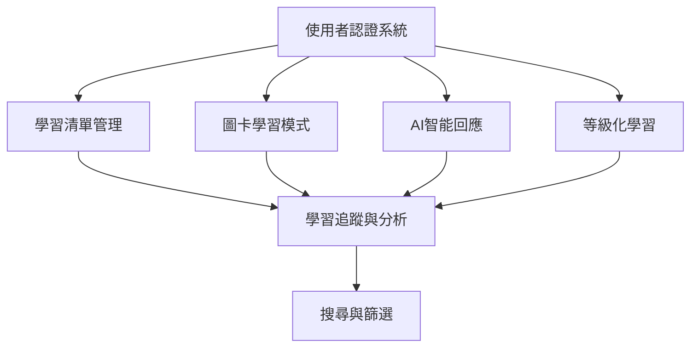

# Smart Learning 功能模組文檔

## 模組概覽

Smart Learning 系統按功能劃分為七個主要模組，每個模組負責特定的業務功能。以下是各模組的詳細設計與實作規範。



## 1. 使用者認證系統

### 功能範圍
- 使用者註冊/登入/登出
- 使用者設定檔管理
- 學習等級設定
- JWT Token 管理
- 未登入用戶導向機制

### 前端實作

#### 組件結構
```
src/components/auth/
├── LoginForm.tsx           # 登入表單
├── RegisterForm.tsx        # 註冊表單
├── UserProfile.tsx         # 使用者設定檔
├── LevelSelector.tsx       # 等級選擇器
├── AuthGuard.tsx          # 路由保護組件
└── AuthRedirect.tsx       # 未登入導向組件
```

#### 核心組件實作
```typescript
// src/components/auth/LoginForm.tsx
import { useForm } from 'react-hook-form'
import { zodResolver } from '@hookform/resolvers/zod'
import { z } from 'zod'
import { useAuth } from '@/hooks/useAuth'

const loginSchema = z.object({
  email: z.string().email('請輸入有效的電子郵件'),
  password: z.string().min(6, '密碼至少需要6個字符'),
})

type LoginFormData = z.infer<typeof loginSchema>

export const LoginForm: React.FC = () => {
  const { login, isLoading } = useAuth()
  const { register, handleSubmit, formState: { errors } } = useForm<LoginFormData>({
    resolver: zodResolver(loginSchema),
  })

  const onSubmit = async (data: LoginFormData) => {
    try {
      await login(data.email, data.password)
    } catch (error) {
      // 錯誤處理
    }
  }

  return (
    <form onSubmit={handleSubmit(onSubmit)} className="space-y-4">
      <div>
        <input
          {...register('email')}
          type="email"
          placeholder="電子郵件"
          className="w-full px-3 py-2 border rounded-md"
        />
        {errors.email && <p className="text-red-500 text-sm">{errors.email.message}</p>}
      </div>
      
      <div>
        <input
          {...register('password')}
          type="password"
          placeholder="密碼"
          className="w-full px-3 py-2 border rounded-md"
        />
        {errors.password && <p className="text-red-500 text-sm">{errors.password.message}</p>}
      </div>
      
      <button
        type="submit"
        disabled={isLoading}
        className="w-full bg-blue-500 text-white py-2 rounded-md hover:bg-blue-600 disabled:opacity-50"
      >
        {isLoading ? '登入中...' : '登入'}
      </button>
    </form>
  )
}
```

#### 狀態管理
```typescript
// src/store/authStore.ts
import { create } from 'zustand'
import { persist } from 'zustand/middleware'

interface AuthState {
  user: User | null
  token: string | null
  isAuthenticated: boolean
  setUser: (user: User) => void
  setToken: (token: string) => void
  logout: () => void
}

export const useAuthStore = create<AuthState>()(
  persist(
    (set) => ({
      user: null,
      token: null,
      isAuthenticated: false,
      setUser: (user) => set({ user, isAuthenticated: true }),
      setToken: (token) => set({ token }),
      logout: () => set({ user: null, token: null, isAuthenticated: false }),
    }),
    { name: 'auth-store' }
  )
)
```

### 後端實作

#### 處理器實作
```go
// internal/handlers/auth.go
package handlers

import (
    "net/http"
    "github.com/gin-gonic/gin"
    "smart-learning-backend/internal/services"
    "smart-learning-backend/internal/models"
)

type AuthHandler struct {
    authService *services.AuthService
}

func NewAuthHandler(authService *services.AuthService) *AuthHandler {
    return &AuthHandler{authService: authService}
}

// 使用者註冊
func (h *AuthHandler) Register(c *gin.Context) {
    var req models.RegisterRequest
    if err := c.ShouldBindJSON(&req); err != nil {
        c.JSON(http.StatusBadRequest, gin.H{"error": err.Error()})
        return
    }

    user, token, err := h.authService.Register(req)
    if err != nil {
        c.JSON(http.StatusBadRequest, gin.H{"error": err.Error()})
        return
    }

    c.JSON(http.StatusCreated, gin.H{
        "user":  user,
        "token": token,
    })
}

// 使用者登入
func (h *AuthHandler) Login(c *gin.Context) {
    var req models.LoginRequest
    if err := c.ShouldBindJSON(&req); err != nil {
        c.JSON(http.StatusBadRequest, gin.H{"error": err.Error()})
        return
    }

    user, token, err := h.authService.Login(req.Email, req.Password)
    if err != nil {
        c.JSON(http.StatusUnauthorized, gin.H{"error": "Invalid credentials"})
        return
    }

    c.JSON(http.StatusOK, gin.H{
        "user":  user,
        "token": token,
    })
}
```

#### 業務邏輯實作
```go
// internal/services/auth_service.go
package services

import (
    "errors"
    "golang.org/x/crypto/bcrypt"
    "smart-learning-backend/internal/models"
    "smart-learning-backend/internal/repository"
    "smart-learning-backend/internal/utils"
)

type AuthService struct {
    userRepo repository.UserRepository
}

func NewAuthService(userRepo repository.UserRepository) *AuthService {
    return &AuthService{userRepo: userRepo}
}

func (s *AuthService) Register(req models.RegisterRequest) (*models.User, string, error) {
    // 檢查使用者是否已存在
    existingUser, _ := s.userRepo.GetByEmail(req.Email)
    if existingUser != nil {
        return nil, "", errors.New("user already exists")
    }

    // 密碼加密
    hashedPassword, err := bcrypt.GenerateFromPassword([]byte(req.Password), bcrypt.DefaultCost)
    if err != nil {
        return nil, "", err
    }

    // 建立使用者
    user := &models.User{
        Email:        req.Email,
        Username:     req.Username,
        PasswordHash: string(hashedPassword),
        LearningLevel: 1,
    }

    if err := s.userRepo.Create(user); err != nil {
        return nil, "", err
    }

    // 生成 JWT Token
    token, err := utils.GenerateJWT(user.ID)
    if err != nil {
        return nil, "", err
    }

    return user, token, nil
}

func (s *AuthService) Login(email, password string) (*models.User, string, error) {
    user, err := s.userRepo.GetByEmail(email)
    if err != nil {
        return nil, "", errors.New("invalid credentials")
    }

    // 驗證密碼
    if err := bcrypt.CompareHashAndPassword([]byte(user.PasswordHash), []byte(password)); err != nil {
        return nil, "", errors.New("invalid credentials")
    }

    // 生成 JWT Token
    token, err := utils.GenerateJWT(user.ID)
    if err != nil {
        return nil, "", err
    }

    return user, token, nil
}
```

### 資料庫設計
```sql
-- 使用者表
CREATE TABLE users (
    id SERIAL PRIMARY KEY,
    email VARCHAR(255) UNIQUE NOT NULL,
    username VARCHAR(100) UNIQUE NOT NULL,
    password_hash VARCHAR(255),
    learning_level INTEGER DEFAULT 1 CHECK (learning_level BETWEEN 1 AND 5),
    avatar_url VARCHAR(500),
    created_at TIMESTAMP DEFAULT CURRENT_TIMESTAMP,
    updated_at TIMESTAMP DEFAULT CURRENT_TIMESTAMP
);

-- 建立索引
CREATE INDEX idx_users_email ON users(email);
```

## 2. 學習清單管理

### 功能範圍
- 建立/編輯/刪除學習清單
- 清單內單字/片語 CRUD
- 清單分享功能
- 清單匯入/匯出

### 前端實作

#### 組件結構
```
src/components/wordlist/
├── WordListCard.tsx        # 清單卡片
├── WordListForm.tsx        # 清單表單
├── WordCard.tsx           # 單字卡片
├── WordForm.tsx           # 單字表單
├── ShareModal.tsx         # 分享模態框
└── ImportExportModal.tsx  # 匯入匯出模態框
```

#### 核心組件實作
```typescript
// src/components/wordlist/WordListCard.tsx
interface WordListCardProps {
  wordList: WordList
  onEdit: (id: string) => void
  onDelete: (id: string) => void
  onShare: (id: string) => void
}

export const WordListCard: React.FC<WordListCardProps> = ({
  wordList,
  onEdit,
  onDelete,
  onShare,
}) => {
  return (
    <div className="bg-white rounded-lg shadow-md p-6 hover:shadow-lg transition-shadow">
      <div className="flex justify-between items-start mb-4">
        <h3 className="text-xl font-semibold text-gray-800">{wordList.name}</h3>
        <div className="flex space-x-2">
          <button
            onClick={() => onEdit(wordList.id)}
            className="text-blue-500 hover:text-blue-700"
          >
            編輯
          </button>
          <button
            onClick={() => onShare(wordList.id)}
            className="text-green-500 hover:text-green-700"
          >
            分享
          </button>
          <button
            onClick={() => onDelete(wordList.id)}
            className="text-red-500 hover:text-red-700"
          >
            刪除
          </button>
        </div>
      </div>
      
      <p className="text-gray-600 mb-4">{wordList.description}</p>
      
      <div className="flex justify-between items-center">
        <span className="text-sm text-gray-500">
          {wordList.wordCount} 個單字
        </span>
        <span className="text-sm text-gray-500">
          建立於 {new Date(wordList.createdAt).toLocaleDateString()}
        </span>
      </div>
    </div>
  )
}
```

### 後端實作

#### API 端點設計
```go
// internal/handlers/wordlist.go
func (h *WordListHandler) CreateWordList(c *gin.Context) {
    userID := getUserID(c)
    var req models.CreateWordListRequest
    
    if err := c.ShouldBindJSON(&req); err != nil {
        c.JSON(http.StatusBadRequest, gin.H{"error": err.Error()})
        return
    }

    wordList, err := h.wordListService.CreateWordList(userID, req)
    if err != nil {
        c.JSON(http.StatusInternalServerError, gin.H{"error": err.Error()})
        return
    }

    c.JSON(http.StatusCreated, wordList)
}

func (h *WordListHandler) GetWordLists(c *gin.Context) {
    userID := getUserID(c)
    page := c.DefaultQuery("page", "1")
    limit := c.DefaultQuery("limit", "10")
    
    wordLists, total, err := h.wordListService.GetUserWordLists(userID, page, limit)
    if err != nil {
        c.JSON(http.StatusInternalServerError, gin.H{"error": err.Error()})
        return
    }

    c.JSON(http.StatusOK, gin.H{
        "data":  wordLists,
        "total": total,
        "page":  page,
        "limit": limit,
    })
}
```

### 資料庫設計
```sql
-- 單字清單表
CREATE TABLE word_lists (
    id SERIAL PRIMARY KEY,
    user_id INTEGER REFERENCES users(id) ON DELETE CASCADE,
    name VARCHAR(200) NOT NULL,
    description TEXT,
    is_public BOOLEAN DEFAULT FALSE,
    share_code VARCHAR(20) UNIQUE,
    created_at TIMESTAMP DEFAULT CURRENT_TIMESTAMP,
    updated_at TIMESTAMP DEFAULT CURRENT_TIMESTAMP
);

-- 單字表
CREATE TABLE words (
    id SERIAL PRIMARY KEY,
    word_list_id INTEGER REFERENCES word_lists(id) ON DELETE CASCADE,
    word VARCHAR(100) NOT NULL,
    pronunciation VARCHAR(200),
    definition TEXT NOT NULL,
    example_sentence TEXT,
    difficulty_level INTEGER DEFAULT 1 CHECK (difficulty_level BETWEEN 1 AND 5),
    created_at TIMESTAMP DEFAULT CURRENT_TIMESTAMP
);

-- 索引
CREATE INDEX idx_word_lists_user_id ON word_lists(user_id);
CREATE INDEX idx_words_word_list_id ON words(word_list_id);
```

## 3. 圖卡學習模式

### 功能範圍
- 翻卡式學習介面
- 學習進度記錄
- 答對/答錯統計
- 復習演算法

### 前端實作

#### 組件結構
```
src/components/learning/
├── FlashCard.tsx          # 翻卡組件
├── LearningSession.tsx    # 學習會話
├── ProgressBar.tsx       # 進度條
├── ResultModal.tsx       # 結果模態框
└── StudyModeSelector.tsx  # 學習模式選擇
```

#### 核心組件實作
```typescript
// src/components/learning/FlashCard.tsx
interface FlashCardProps {
  word: Word
  onCorrect: () => void
  onIncorrect: () => void
  showAnswer: boolean
  onFlip: () => void
}

export const FlashCard: React.FC<FlashCardProps> = ({
  word,
  onCorrect,
  onIncorrect,
  showAnswer,
  onFlip,
}) => {
  return (
    <div className="relative w-full max-w-md mx-auto">
      <div
        className={`card-container ${showAnswer ? 'flipped' : ''}`}
        onClick={onFlip}
      >
        <div className="card-front bg-white rounded-xl shadow-lg p-8 cursor-pointer">
          <div className="text-center">
            <h2 className="text-3xl font-bold text-gray-800 mb-4">
              {word.word}
            </h2>
            {word.pronunciation && (
              <p className="text-lg text-gray-600 mb-4">
                [{word.pronunciation}]
              </p>
            )}
            <p className="text-sm text-gray-500">點擊查看答案</p>
          </div>
        </div>
        
        <div className="card-back bg-blue-50 rounded-xl shadow-lg p-8">
          <div className="text-center">
            <h2 className="text-2xl font-bold text-gray-800 mb-4">
              {word.word}
            </h2>
            <p className="text-lg text-gray-700 mb-4">
              {word.definition}
            </p>
            {word.exampleSentence && (
              <p className="text-md text-gray-600 italic mb-6">
                "{word.exampleSentence}"
              </p>
            )}
            
            <div className="flex justify-center space-x-4">
              <button
                onClick={(e) => {
                  e.stopPropagation()
                  onIncorrect()
                }}
                className="bg-red-500 text-white px-6 py-3 rounded-lg hover:bg-red-600"
              >
                不認識
              </button>
              <button
                onClick={(e) => {
                  e.stopPropagation()
                  onCorrect()
                }}
                className="bg-green-500 text-white px-6 py-3 rounded-lg hover:bg-green-600"
              >
                認識
              </button>
            </div>
          </div>
        </div>
      </div>
    </div>
  )
}
```

### 學習演算法實作
```typescript
// src/utils/learningAlgorithm.ts
export class SpacedRepetitionAlgorithm {
  // 根據答對情況計算下次復習時間
  static calculateNextReview(
    correctCount: number,
    incorrectCount: number,
    lastStudied: Date
  ): Date {
    const accuracy = correctCount / (correctCount + incorrectCount)
    let intervalDays: number

    if (accuracy >= 0.9) {
      intervalDays = Math.min(30, Math.pow(2, Math.floor(correctCount / 3)))
    } else if (accuracy >= 0.7) {
      intervalDays = Math.min(7, Math.pow(1.5, Math.floor(correctCount / 2)))
    } else {
      intervalDays = 1 // 每天復習
    }

    const nextReview = new Date(lastStudied)
    nextReview.setDate(nextReview.getDate() + intervalDays)
    return nextReview
  }

  // 選擇需要復習的單字
  static selectWordsForReview(words: WordWithStats[]): WordWithStats[] {
    const now = new Date()
    const needReview = words.filter(word => 
      !word.lastStudied || word.nextReview <= now
    )

    // 優先級排序：錯誤率高的優先，然後是很久沒復習的
    return needReview.sort((a, b) => {
      const aErrorRate = a.incorrectCount / (a.correctCount + a.incorrectCount || 1)
      const bErrorRate = b.incorrectCount / (b.correctCount + b.incorrectCount || 1)
      
      if (aErrorRate !== bErrorRate) {
        return bErrorRate - aErrorRate
      }
      
      const aDaysSinceReview = a.lastStudied ? 
        (now.getTime() - a.lastStudied.getTime()) / (1000 * 60 * 60 * 24) : 999
      const bDaysSinceReview = b.lastStudied ? 
        (now.getTime() - b.lastStudied.getTime()) / (1000 * 60 * 60 * 24) : 999
        
      return bDaysSinceReview - aDaysSinceReview
    })
  }
}
```

## 4. AI 智能回應

### 功能範圍
- 多樣化單字解釋生成
- 同義詞/反義詞推薦
- 詞根家族分析
- 記憶法與口訣生成

### 後端實作

#### AI 服務整合
```go
// internal/services/ai_service.go
package services

import (
    "bytes"
    "encoding/json"
    "fmt"
    "net/http"
    "smart-learning-backend/internal/models"
)

type AIService struct {
    apiKey  string
    baseURL string
    client  *http.Client
}

func NewAIService(apiKey string) *AIService {
    return &AIService{
        apiKey:  apiKey,
        baseURL: "https://api.anthropic.com/v1/messages",
        client:  &http.Client{},
    }
}

func (s *AIService) GenerateWordExplanation(word string, userLevel int) (*models.AIResponse, error) {
    prompt := s.buildPrompt(word, userLevel)
    
    reqBody := models.ClaudeRequest{
        Model:     "claude-3-haiku-20240307",
        MaxTokens: 1000,
        Messages: []models.Message{
            {
                Role:    "user",
                Content: prompt,
            },
        },
    }

    jsonData, err := json.Marshal(reqBody)
    if err != nil {
        return nil, err
    }

    req, err := http.NewRequest("POST", s.baseURL, bytes.NewBuffer(jsonData))
    if err != nil {
        return nil, err
    }

    req.Header.Set("Content-Type", "application/json")
    req.Header.Set("x-api-key", s.apiKey)
    req.Header.Set("anthropic-version", "2023-06-01")

    resp, err := s.client.Do(req)
    if err != nil {
        return nil, err
    }
    defer resp.Body.Close()

    var claudeResp models.ClaudeResponse
    if err := json.NewDecoder(resp.Body).Decode(&claudeResp); err != nil {
        return nil, err
    }

    return s.parseAIResponse(claudeResp.Content[0].Text), nil
}

func (s *AIService) buildPrompt(word string, userLevel int) string {
    levelDescription := map[int]string{
        1: "初學者 (基礎詞彙)",
        2: "初級 (常用詞彙)",
        3: "中級 (中等難度詞彙)",
        4: "中高級 (進階詞彙)",
        5: "高級 (學術/專業詞彙)",
    }

    return fmt.Sprintf(`
請為英語學習者詳細解釋單字 "%s"。
使用者等級：%s

請以JSON格式回應，包含以下內容：
{
  "definition": "詳細定義（用%s等級的語言解釋）",
  "synonyms": ["同義詞1", "同義詞2", "同義詞3"],
  "antonyms": ["反義詞1", "反義詞2"],
  "wordFamily": {
    "root": "詞根",
    "related": ["相關詞彙1", "相關詞彙2"]
  },
  "memoryTips": "創意記憶法或口訣",
  "examples": [
    {
      "sentence": "例句1（符合使用者等級）",
      "translation": "中文翻譯"
    },
    {
      "sentence": "例句2（符合使用者等級）",
      "translation": "中文翻譯"
    }
  ],
  "difficulty": %d,
  "partOfSpeech": "詞性"
}

注意：
1. 根據使用者等級調整語言複雜度
2. 提供實用的記憶技巧
3. 例句要生動有趣且實用
4. 確保JSON格式正確
`, word, levelDescription[userLevel], levelDescription[userLevel], userLevel)
}
```

### 前端AI功能組件
```typescript
// src/components/ai/AIExplanation.tsx
interface AIExplanationProps {
  word: string
  userLevel: number
}

export const AIExplanation: React.FC<AIExplanationProps> = ({ word, userLevel }) => {
  const { data: aiData, isLoading, error } = useQuery({
    queryKey: ['ai-explanation', word, userLevel],
    queryFn: () => aiService.getWordExplanation(word, userLevel),
    enabled: !!word,
  })

  if (isLoading) return <AILoadingSkeleton />
  if (error) return <div>AI 解釋載入失敗</div>
  if (!aiData) return null

  return (
    <div className="bg-gradient-to-br from-purple-50 to-blue-50 rounded-xl p-6 mt-4">
      <div className="flex items-center mb-4">
        <div className="w-8 h-8 bg-purple-500 rounded-full flex items-center justify-center">
          <span className="text-white text-sm font-bold">AI</span>
        </div>
        <h3 className="ml-3 text-lg font-semibold text-gray-800">AI 智能解釋</h3>
      </div>

      <div className="space-y-4">
        {/* 詳細定義 */}
        <div>
          <h4 className="font-semibold text-gray-700 mb-2">詳細定義</h4>
          <p className="text-gray-600">{aiData.definition}</p>
        </div>

        {/* 同義詞與反義詞 */}
        <div className="grid grid-cols-1 md:grid-cols-2 gap-4">
          <div>
            <h4 className="font-semibold text-gray-700 mb-2">同義詞</h4>
            <div className="flex flex-wrap gap-2">
              {aiData.synonyms.map((synonym, index) => (
                <span key={index} className="bg-green-100 text-green-800 px-3 py-1 rounded-full text-sm">
                  {synonym}
                </span>
              ))}
            </div>
          </div>
          
          <div>
            <h4 className="font-semibold text-gray-700 mb-2">反義詞</h4>
            <div className="flex flex-wrap gap-2">
              {aiData.antonyms.map((antonym, index) => (
                <span key={index} className="bg-red-100 text-red-800 px-3 py-1 rounded-full text-sm">
                  {antonym}
                </span>
              ))}
            </div>
          </div>
        </div>

        {/* 詞根分析 */}
        {aiData.wordFamily && (
          <div>
            <h4 className="font-semibold text-gray-700 mb-2">詞根家族</h4>
            <p className="text-sm text-gray-600 mb-2">
              詞根：<span className="font-medium">{aiData.wordFamily.root}</span>
            </p>
            <div className="flex flex-wrap gap-2">
              {aiData.wordFamily.related.map((related, index) => (
                <span key={index} className="bg-blue-100 text-blue-800 px-3 py-1 rounded-full text-sm">
                  {related}
                </span>
              ))}
            </div>
          </div>
        )}

        {/* 記憶法 */}
        <div>
          <h4 className="font-semibold text-gray-700 mb-2">記憶技巧 💡</h4>
          <div className="bg-yellow-50 border-l-4 border-yellow-400 p-4 rounded">
            <p className="text-gray-700">{aiData.memoryTips}</p>
          </div>
        </div>

        {/* 例句 */}
        <div>
          <h4 className="font-semibold text-gray-700 mb-2">例句示範</h4>
          <div className="space-y-3">
            {aiData.examples.map((example, index) => (
              <div key={index} className="bg-white rounded-lg p-4 border">
                <p className="text-gray-800 mb-2">"{example.sentence}"</p>
                <p className="text-gray-600 text-sm italic">{example.translation}</p>
              </div>
            ))}
          </div>
        </div>
      </div>
    </div>
  )
}
```

## 5. 等級化學習

### 功能範圍
- 根據使用者等級調整內容難度
- 不同情境的例句生成
- 個人化學習建議
- 自適應難度調整

### 實作策略

#### 等級系統設計
```typescript
// src/types/learning.ts
export enum LearningLevel {
  BEGINNER = 1,     // 初學者 (1000-2000 常用詞)
  ELEMENTARY = 2,   // 初級 (2000-3000 詞)
  INTERMEDIATE = 3, // 中級 (3000-5000 詞)
  UPPER_INT = 4,    // 中高級 (5000-8000 詞)
  ADVANCED = 5,     // 高級 (8000+ 詞，學術詞彙)
}

export interface LevelConfig {
  level: LearningLevel
  name: string
  description: string
  vocabularyRange: [number, number]
  grammarComplexity: 'simple' | 'moderate' | 'complex'
  exampleSentenceLength: 'short' | 'medium' | 'long'
  culturalContext: boolean
}

export const LEVEL_CONFIGS: Record<LearningLevel, LevelConfig> = {
  [LearningLevel.BEGINNER]: {
    level: 1,
    name: '初學者',
    description: '基礎詞彙，簡單句型',
    vocabularyRange: [1, 2000],
    grammarComplexity: 'simple',
    exampleSentenceLength: 'short',
    culturalContext: false,
  },
  // ... 其他等級配置
}
```

#### 自適應學習邏輯
```go
// internal/services/adaptive_learning_service.go
func (s *AdaptiveLearningService) AdjustUserLevel(userID int) error {
    stats, err := s.getLearningStats(userID, 30) // 最近30天
    if err != nil {
        return err
    }

    currentLevel := stats.User.LearningLevel
    newLevel := s.calculateNewLevel(stats, currentLevel)

    if newLevel != currentLevel {
        return s.userRepo.UpdateLearningLevel(userID, newLevel)
    }

    return nil
}

func (s *AdaptiveLearningService) calculateNewLevel(stats *LearningStats, currentLevel int) int {
    accuracy := float64(stats.CorrectAnswers) / float64(stats.TotalAnswers)
    avgStudyTime := stats.TotalStudyTime / stats.StudyDays

    // 升級條件
    if accuracy >= 0.85 && avgStudyTime >= 15*60 && currentLevel < 5 { // 15分鐘
        return currentLevel + 1
    }

    // 降級條件（避免挫折感）
    if accuracy < 0.4 && currentLevel > 1 {
        return currentLevel - 1
    }

    return currentLevel
}
```

## 6. 學習追蹤與分析

### 功能範圍
- 正確率分析
- 定時學習提醒

### 前端實作

#### 數據視覺化組件
```typescript
// src/components/analytics/LearningChart.tsx
import { LineChart, Line, XAxis, YAxis, CartesianGrid, Tooltip, ResponsiveContainer } from 'recharts'

interface LearningChartProps {
  data: LearningProgressData[]
  timeRange: 'week' | 'month' | 'year'
}

export const LearningChart: React.FC<LearningChartProps> = ({ data, timeRange }) => {
  const formatData = (rawData: LearningProgressData[]) => {
    return rawData.map(item => ({
      date: formatDate(item.date, timeRange),
      accuracy: (item.correctAnswers / item.totalAnswers * 100).toFixed(1),
      wordsLearned: item.newWords,
      studyTime: Math.round(item.studyTimeMinutes),
    }))
  }

  return (
    <div className="bg-white rounded-xl shadow-lg p-6">
      <h3 className="text-xl font-semibold mb-4">學習進度分析</h3>
      
      <ResponsiveContainer width="100%" height={400}>
        <LineChart data={formatData(data)}>
          <CartesianGrid strokeDasharray="3 3" />
          <XAxis dataKey="date" />
          <YAxis yAxisId="left" />
          <YAxis yAxisId="right" orientation="right" />
          <Tooltip />
          
          <Line
            yAxisId="left"
            type="monotone"
            dataKey="accuracy"
            stroke="#8884d8"
            strokeWidth={2}
            name="正確率 (%)"
          />
          
          <Line
            yAxisId="right"
            type="monotone"
            dataKey="wordsLearned"
            stroke="#82ca9d"
            strokeWidth={2}
            name="新學單字"
          />
        </LineChart>
      </ResponsiveContainer>

      <div className="grid grid-cols-3 gap-4 mt-6">
        <div className="text-center">
          <div className="text-2xl font-bold text-blue-600">
            {data.reduce((sum, item) => sum + item.totalAnswers, 0)}
          </div>
          <div className="text-sm text-gray-600">總答題數</div>
        </div>
        
        <div className="text-center">
          <div className="text-2xl font-bold text-green-600">
            {(data.reduce((sum, item) => sum + item.correctAnswers, 0) / 
              data.reduce((sum, item) => sum + item.totalAnswers, 0) * 100).toFixed(1)}%
          </div>
          <div className="text-sm text-gray-600">平均正確率</div>
        </div>
        
        <div className="text-center">
          <div className="text-2xl font-bold text-purple-600">
            {Math.round(data.reduce((sum, item) => sum + item.studyTimeMinutes, 0) / 60)}h
          </div>
          <div className="text-sm text-gray-600">總學習時間</div>
        </div>
      </div>
    </div>
  )
}
```

### 後端分析服務
```go
// internal/services/analytics_service.go
func (s *AnalyticsService) GetLearningStats(userID int, days int) (*models.LearningAnalytics, error) {
    endDate := time.Now()
    startDate := endDate.AddDate(0, 0, -days)

    // 獲取學習記錄
    records, err := s.learningRepo.GetRecordsInRange(userID, startDate, endDate)
    if err != nil {
        return nil, err
    }

    // 計算統計數據
    analytics := &models.LearningAnalytics{
        UserID:    userID,
        Period:    fmt.Sprintf("%d days", days),
        StartDate: startDate,
        EndDate:   endDate,
    }

    analytics.TotalWords = len(records)
    analytics.TotalStudyTime = s.calculateTotalStudyTime(records)
    analytics.AverageAccuracy = s.calculateAverageAccuracy(records)
    analytics.DailyProgress = s.groupByDay(records)
    analytics.WeakWords = s.identifyWeakWords(records)
    analytics.StreakDays = s.calculateStreak(userID, endDate)

    return analytics, nil
}

func (s *AnalyticsService) identifyWeakWords(records []models.LearningRecord) []models.WeakWord {
    wordStats := make(map[int]*models.WordStats)

    // 計算每個單字的統計
    for _, record := range records {
        if stats, exists := wordStats[record.WordID]; exists {
            stats.TotalAttempts += record.CorrectCount + record.IncorrectCount
            stats.CorrectAttempts += record.CorrectCount
        } else {
            wordStats[record.WordID] = &models.WordStats{
                WordID:          record.WordID,
                TotalAttempts:   record.CorrectCount + record.IncorrectCount,
                CorrectAttempts: record.CorrectCount,
            }
        }
    }

    // 找出需要加強的單字（正確率 < 60%）
    var weakWords []models.WeakWord
    for wordID, stats := range wordStats {
        accuracy := float64(stats.CorrectAttempts) / float64(stats.TotalAttempts)
        if accuracy < 0.6 && stats.TotalAttempts >= 3 {
            word, _ := s.wordRepo.GetByID(wordID)
            weakWords = append(weakWords, models.WeakWord{
                Word:     word,
                Accuracy: accuracy,
                Attempts: stats.TotalAttempts,
            })
        }
    }

    // 按正確率排序
    sort.Slice(weakWords, func(i, j int) bool {
        return weakWords[i].Accuracy < weakWords[j].Accuracy
    })

    return weakWords
}
```

## 7. 搜尋與篩選

### 功能範圍
- 清單內容搜尋
- 學習狀態篩選
- 標籤分類系統
- 進階搜尋功能

### 前端實作

#### 搜尋組件
```typescript
// src/components/search/SearchFilter.tsx
interface SearchFilterProps {
  onSearch: (params: SearchParams) => void
  onReset: () => void
}

export const SearchFilter: React.FC<SearchFilterProps> = ({ onSearch, onReset }) => {
  const [searchParams, setSearchParams] = useState<SearchParams>({
    keyword: '',
    difficulty: '',
    mastery: '',
    tags: [],
    sortBy: 'created_at',
    sortOrder: 'desc',
  })

  const handleSearch = () => {
    onSearch(searchParams)
  }

  return (
    <div className="bg-white rounded-xl shadow-md p-6 mb-6">
      <div className="grid grid-cols-1 md:grid-cols-2 lg:grid-cols-4 gap-4">
        {/* 關鍵字搜尋 */}
        <div>
          <label className="block text-sm font-medium text-gray-700 mb-2">
            搜尋單字
          </label>
          <input
            type="text"
            value={searchParams.keyword}
            onChange={(e) => setSearchParams({...searchParams, keyword: e.target.value})}
            placeholder="輸入單字或定義..."
            className="w-full px-3 py-2 border border-gray-300 rounded-md focus:outline-none focus:ring-2 focus:ring-blue-500"
          />
        </div>

        {/* 難度篩選 */}
        <div>
          <label className="block text-sm font-medium text-gray-700 mb-2">
            難度等級
          </label>
          <select
            value={searchParams.difficulty}
            onChange={(e) => setSearchParams({...searchParams, difficulty: e.target.value})}
            className="w-full px-3 py-2 border border-gray-300 rounded-md focus:outline-none focus:ring-2 focus:ring-blue-500"
          >
            <option value="">全部難度</option>
            <option value="1">初學者</option>
            <option value="2">初級</option>
            <option value="3">中級</option>
            <option value="4">中高級</option>
            <option value="5">高級</option>
          </select>
        </div>

        {/* 掌握程度篩選 */}
        <div>
          <label className="block text-sm font-medium text-gray-700 mb-2">
            掌握程度
          </label>
          <select
            value={searchParams.mastery}
            onChange={(e) => setSearchParams({...searchParams, mastery: e.target.value})}
            className="w-full px-3 py-2 border border-gray-300 rounded-md focus:outline-none focus:ring-2 focus:ring-blue-500"
          >
            <option value="">全部程度</option>
            <option value="new">未學習</option>
            <option value="learning">學習中</option>
            <option value="familiar">熟悉</option>
            <option value="mastered">已掌握</option>
          </select>
        </div>

        {/* 排序方式 */}
        <div>
          <label className="block text-sm font-medium text-gray-700 mb-2">
            排序方式
          </label>
          <select
            value={`${searchParams.sortBy}-${searchParams.sortOrder}`}
            onChange={(e) => {
              const [sortBy, sortOrder] = e.target.value.split('-')
              setSearchParams({...searchParams, sortBy, sortOrder})
            }}
            className="w-full px-3 py-2 border border-gray-300 rounded-md focus:outline-none focus:ring-2 focus:ring-blue-500"
          >
            <option value="created_at-desc">最新建立</option>
            <option value="created_at-asc">最舊建立</option>
            <option value="word-asc">字母順序</option>
            <option value="difficulty-asc">難度：低到高</option>
            <option value="difficulty-desc">難度：高到低</option>
            <option value="accuracy-asc">正確率：低到高</option>
            <option value="accuracy-desc">正確率：高到低</option>
          </select>
        </div>
      </div>

      <div className="flex justify-between items-center mt-4">
        <div className="flex space-x-2">
          <button
            onClick={handleSearch}
            className="bg-blue-500 text-white px-6 py-2 rounded-md hover:bg-blue-600 transition-colors"
          >
            搜尋
          </button>
          <button
            onClick={onReset}
            className="bg-gray-500 text-white px-6 py-2 rounded-md hover:bg-gray-600 transition-colors"
          >
            重置
          </button>
        </div>

        <div className="text-sm text-gray-600">
          快捷鍵：Ctrl + K 開啟快速搜尋
        </div>
      </div>
    </div>
  )
}
```

### 後端搜尋實作
```go
// internal/services/search_service.go
func (s *SearchService) SearchWords(userID int, params models.SearchParams) (*models.SearchResult, error) {
    query := s.buildSearchQuery(userID, params)
    
    words, total, err := s.wordRepo.SearchWithFilters(query)
    if err != nil {
        return nil, err
    }

    return &models.SearchResult{
        Words:      words,
        Total:      total,
        Page:       params.Page,
        Limit:      params.Limit,
        Query:      params.Keyword,
        Filters:    params,
        TotalPages: (total + params.Limit - 1) / params.Limit,
    }, nil
}

func (s *SearchService) buildSearchQuery(userID int, params models.SearchParams) string {
    var conditions []string
    var args []interface{}
    argIndex := 1

    // 基本條件：只搜尋用戶的單字
    conditions = append(conditions, fmt.Sprintf("wl.user_id = $%d", argIndex))
    args = append(args, userID)
    argIndex++

    // 關鍵字搜尋
    if params.Keyword != "" {
        conditions = append(conditions, fmt.Sprintf(`
            (w.word ILIKE $%d OR w.definition ILIKE $%d OR w.example_sentence ILIKE $%d)
        `, argIndex, argIndex, argIndex))
        searchTerm := "%" + params.Keyword + "%"
        args = append(args, searchTerm)
        argIndex++
    }

    // 難度篩選
    if params.Difficulty != "" {
        conditions = append(conditions, fmt.Sprintf("w.difficulty_level = $%d", argIndex))
        args = append(args, params.Difficulty)
        argIndex++
    }

    // 掌握程度篩選
    if params.Mastery != "" {
        switch params.Mastery {
        case "new":
            conditions = append(conditions, "lr.id IS NULL")
        case "learning":
            conditions = append(conditions, "lr.mastery_level BETWEEN 1 AND 2")
        case "familiar":
            conditions = append(conditions, "lr.mastery_level = 3")
        case "mastered":
            conditions = append(conditions, "lr.mastery_level >= 4")
        }
    }

    // 構建完整查詢
    baseQuery := `
        SELECT DISTINCT w.*, 
               COALESCE(lr.correct_count, 0) as correct_count,
               COALESCE(lr.incorrect_count, 0) as incorrect_count,
               COALESCE(lr.mastery_level, 0) as mastery_level,
               lr.last_studied_at
        FROM words w
        JOIN word_lists wl ON w.word_list_id = wl.id
        LEFT JOIN learning_records lr ON w.id = lr.word_id AND lr.user_id = wl.user_id
    `

    if len(conditions) > 0 {
        baseQuery += " WHERE " + strings.Join(conditions, " AND ")
    }

    // 排序
    orderBy := s.buildOrderClause(params.SortBy, params.SortOrder)
    baseQuery += " " + orderBy

    // 分頁
    if params.Limit > 0 {
        offset := (params.Page - 1) * params.Limit
        baseQuery += fmt.Sprintf(" LIMIT %d OFFSET %d", params.Limit, offset)
    }

    return baseQuery
}
```

這份功能模組文檔詳細描述了 Smart Learning 系統的七個核心模組，包含完整的前後端實作範例、資料庫設計和業務邏輯。每個模組都遵循系統架構設計，確保功能完整性和可維護性。