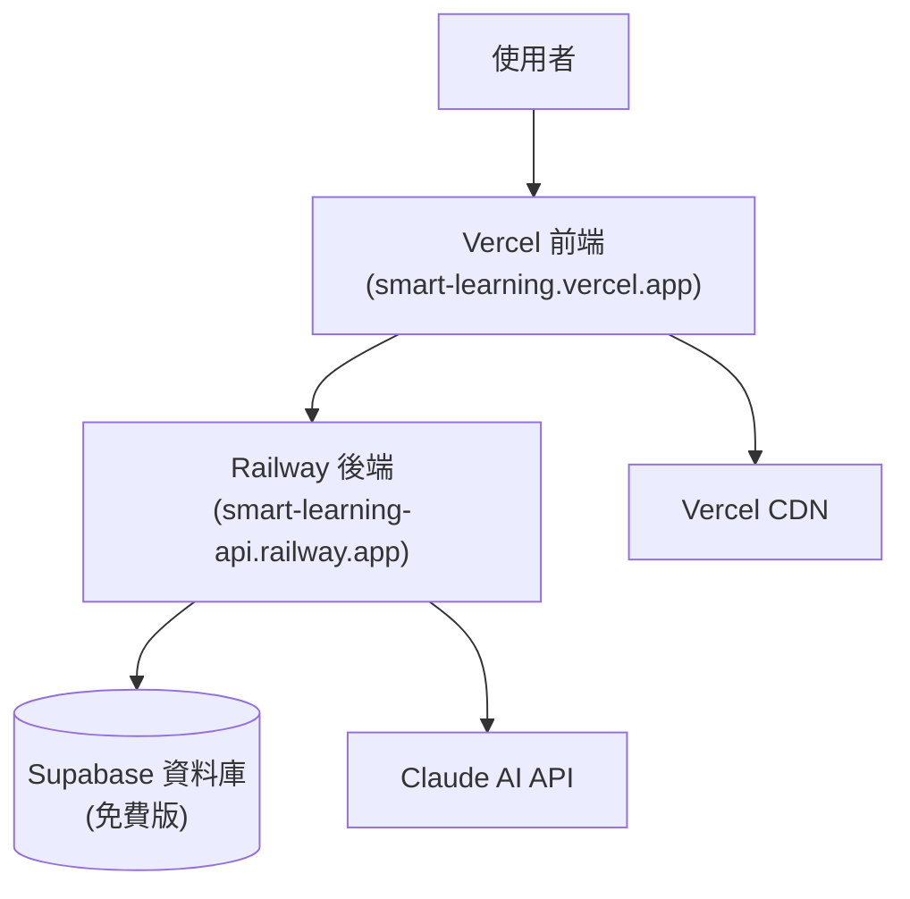

# Smart Learning 部署指南

## Monorepo 部署策略

Smart Learning 採用 Monorepo 結構，前後端分別部署到不同平台：
- **前端**：部署到 Vercel (免費)
- **後端**：部署到 Railway (免費版)
- **資料庫**：Supabase (免費版)



### 部署架構說明
在 Monorepo 結構下：
1. **Vercel** 只部署 `frontend/` 目錄的內容
2. **Railway** 只部署 `backend/` 目錄的內容  
3. 兩者通過 **API 端點** 進行通訊
4. 共享同一個 Git 倉庫，但部署到不同服務

## 前端部署 (Vercel)

### Monorepo 中的 Vercel 部署

#### 1. 在 Vercel 中設定專案
```bash
# 在專案根目錄執行（不是在 frontend 目錄內）
npx vercel

# Vercel 會詢問設定，請選擇：
# ? Set up and deploy "smart-learning"? [Y/n] Y
# ? Which scope do you want to deploy to? [your-account]
# ? Link to existing project? [y/N] N
# ? What's your project's name? smart-learning
# ? In which directory is your code located? frontend/
```

#### 2. Vercel 專案設定
在 Vercel Dashboard 中設定：
- **Framework**: Vite
- **Root Directory**: `frontend`
- **Build Command**: `npm run build`
- **Output Directory**: `dist`
- **Install Command**: `npm install`

#### 3. 設定環境變數
在 Vercel Dashboard > Settings > Environment Variables 中設定：
```bash
VITE_API_URL=https://your-railway-app.railway.app/api
VITE_GOOGLE_CLIENT_ID=your_google_client_id
VITE_APP_ENV=production
```

#### 4. 部署流程
```bash
# 方法一：自動部署（推薦）
# 連接 GitHub 倉庫後，每次推送到 main 分支自動部署

# 方法二：手動部署
npm i -g vercel
vercel --prod  # 在專案根目錄執行
```

### 前端優化配置

#### Vite 生產配置
```typescript
// frontend/vite.config.ts
import { defineConfig } from 'vite'
import react from '@vitejs/plugin-react'
import path from 'path'

export default defineConfig({
  plugins: [react()],
  resolve: {
    alias: {
      '@': path.resolve(__dirname, './src'),
    },
  },
  build: {
    rollupOptions: {
      output: {
        manualChunks: {
          vendor: ['react', 'react-dom'],
          router: ['@tanstack/react-router'],
          ui: ['@radix-ui/react-dialog', '@radix-ui/react-dropdown-menu'],
        },
      },
    },
  },
  server: {
    port: 3000,
  },
  preview: {
    port: 3000,
  },
})
```

## 後端部署 (Railway 免費版)

### Railway 免費版限制
- **執行時間**: 每月 500 小時
- **記憶體**: 512MB
- **網路**: 100GB 出站流量
- **睡眠模式**: 無活動時會自動休眠

### Monorepo 中的 Railway 部署

#### 1. 建立 Railway 專案
```bash
# 在專案根目錄安裝 Railway CLI
npm install -g @railway/cli

# 登入 Railway
railway login

# 建立新專案
railway new
# 選擇 "Empty Project"
```

#### 2. 設定 Railway 配置
在專案根目錄建立 `railway.toml`：
```toml
[build]
builder = "NIXPACKS"
watchPatterns = ["backend/**"]

[deploy]
startCommand = "cd backend && go run cmd/main.go"
healthcheckPath = "/health"
healthcheckTimeout = 300
restartPolicyType = "ON_FAILURE"

[env]
PORT = "8080"
```

#### 3. 設定環境變數
```bash
# 使用 Railway CLI 設定環境變數
railway variables set PORT=8080
railway variables set DATABASE_URL="your_supabase_connection_string"
railway variables set JWT_SECRET="your_strong_jwt_secret"
railway variables set CLAUDE_API_KEY="your_claude_api_key"
railway variables set GOOGLE_CLIENT_ID="your_google_client_id"
railway variables set GOOGLE_CLIENT_SECRET="your_google_client_secret"
railway variables set CORS_ORIGIN="https://smart-learning.vercel.app"
```

#### 4. Railway 部署流程
```bash
# 連接到 Railway 專案
railway link

# 手動部署
railway up

# 或設定自動部署（推薦）
# 在 Railway Dashboard 連接 GitHub 倉庫
# 設定 Root Directory 為 "backend"
```

#### 5. 檢查部署狀態
```bash
# 查看部署日誌
railway logs

# 查看服務狀態
railway status

# 取得服務 URL
railway domain
```

#### 6. 健康檢查端點
```go
// internal/handlers/health.go
func (h *HealthHandler) HealthCheck(c *gin.Context) {
    // 檢查資料庫連線
    if err := h.db.Ping(); err != nil {
        c.JSON(http.StatusServiceUnavailable, gin.H{
            "status": "unhealthy",
            "error":  "database connection failed",
        })
        return
    }

    c.JSON(http.StatusOK, gin.H{
        "status":    "healthy",
        "timestamp": time.Now().Unix(),
        "version":   "1.0.0",
    })
}
```

## 資料庫設定 (Supabase)

### 1. Supabase 專案設定

#### 資料庫配置
```sql
-- 啟用 Row Level Security
ALTER TABLE users ENABLE ROW LEVEL SECURITY;
ALTER TABLE word_lists ENABLE ROW LEVEL SECURITY;
ALTER TABLE words ENABLE ROW LEVEL SECURITY;
ALTER TABLE learning_records ENABLE ROW LEVEL SECURITY;

-- 建立 RLS 政策
CREATE POLICY "Users can view own data" ON users
  FOR ALL USING (auth.uid() = id::text);

CREATE POLICY "Users can manage own word lists" ON word_lists
  FOR ALL USING (auth.uid() = user_id::text);

CREATE POLICY "Users can view public word lists" ON word_lists
  FOR SELECT USING (is_public = true OR auth.uid() = user_id::text);
```

#### 環境變數
```bash
# Supabase 設定
SUPABASE_URL=https://your-project.supabase.co
SUPABASE_ANON_KEY=your_anon_key
SUPABASE_SERVICE_KEY=your_service_key
```

### 2. 資料庫遷移

#### 遷移腳本
```bash
#!/bin/bash
# scripts/migrate.sh

echo "Running database migrations..."

# 檢查環境變數
if [ -z "$DATABASE_URL" ]; then
  echo "Error: DATABASE_URL not set"
  exit 1
fi

# 執行遷移
migrate -path backend/migrations -database "$DATABASE_URL" up

echo "Migrations completed successfully"
```

## 完整部署流程

### 第一次部署步驟

#### 1. 準備工作
```bash
# 確保專案結構正確
smart-learning/
├── frontend/          # React 專案
├── backend/           # Go 專案  
├── docs/             # 文檔
└── railway.toml      # Railway 配置
```

#### 2. 部署後端到 Railway
```bash
# 在專案根目錄
railway login
railway new
railway link

# 設定環境變數
railway variables set PORT=8080
railway variables set DATABASE_URL="your_supabase_url"
# ... 其他環境變數

# 部署
railway up
```

#### 3. 部署前端到 Vercel
```bash
# 在專案根目錄（不是 frontend 目錄）
npx vercel

# 按照提示設定：
# Root Directory: frontend
# Framework: Vite
```

#### 4. 更新前端 API URL
```bash
# 取得 Railway 服務 URL
railway domain

# 在 Vercel 設定環境變數
# VITE_API_URL=https://your-app.railway.app/api
```

### 日常開發部署

#### 自動部署（推薦）
1. **Vercel**: 連接 GitHub，推送到 main 分支自動部署
2. **Railway**: 連接 GitHub，偵測 backend/ 變更自動部署

#### 手動部署
```bash
# 前端
vercel --prod

# 後端
railway up
```

## 監控與日誌

### 1. 應用監控

#### 前端監控 (Vercel Analytics)
```typescript
// frontend/src/lib/analytics.ts
import { Analytics } from '@vercel/analytics/react'

export function AnalyticsProvider({ children }: { children: React.ReactNode }) {
  return (
    <>
      {children}
      <Analytics />
    </>
  )
}
```

#### 後端監控
```go
// internal/middleware/monitoring.go
func Monitoring() gin.HandlerFunc {
    return gin.LoggerWithFormatter(func(param gin.LogFormatterParams) string {
        return fmt.Sprintf(`{
            "time": "%s",
            "method": "%s",
            "path": "%s",
            "status": %d,
            "latency": "%s",
            "ip": "%s",
            "user_agent": "%s"
        }`,
            param.TimeStamp.Format(time.RFC3339),
            param.Method,
            param.Path,
            param.StatusCode,
            param.Latency,
            param.ClientIP,
            param.Request.UserAgent(),
        )
    })
}
```

## 安全性配置

### 1. CORS 設定
```go
// internal/middleware/cors.go
func CORS() gin.HandlerFunc {
    return func(c *gin.Context) {
        origin := c.Request.Header.Get("Origin")
        
        allowedOrigins := []string{
            "https://smart-learning.vercel.app",
            "https://smart-learning-preview.vercel.app",
        }
        
        if contains(allowedOrigins, origin) {
            c.Header("Access-Control-Allow-Origin", origin)
        }
        
        c.Header("Access-Control-Allow-Methods", "GET, POST, PUT, DELETE, OPTIONS")
        c.Header("Access-Control-Allow-Headers", "Content-Type, Authorization")
        
        if c.Request.Method == "OPTIONS" {
            c.AbortWithStatus(204)
            return
        }
        
        c.Next()
    }
}
```

### 2. 環境變數安全
```bash
# 生產環境變數檢查清單
- [ ] JWT_SECRET 使用強密碼
- [ ] CLAUDE_API_KEY 已設定
- [ ] DATABASE_URL 連線加密
- [ ] CORS_ORIGIN 限制正確域名
- [ ] 敏感資訊不在程式碼中
```

## 部署檢查清單

### 部署前確認
- [ ] 所有測試通過
- [ ] 環境變數已設定
- [ ] 資料庫遷移完成
- [ ] API 文檔更新
- [ ] Railway 配置正確

### 部署後驗證
- [ ] 前端頁面正常載入
- [ ] API 端點回應正常
- [ ] 資料庫連線正常
- [ ] 認證功能正常
- [ ] AI 服務整合正常

## 常見問題

### Q: Railway 免費版有什麼限制？
A: 每月 500 小時執行時間，無活動時會自動休眠，適合開發和小型專案。

### Q: Monorepo 結構下如何部署？
A: Vercel 設定 Root Directory 為 `frontend`，Railway 設定為 `backend`，兩者獨立部署。

### Q: 如何處理 Railway 睡眠模式？
A: 可以設定定期 ping 或升級到付費版本。免費版適合開發階段使用。

### Q: 前端如何連接到後端 API？
A: 設定 `VITE_API_URL` 環境變數指向 Railway 提供的 URL。

這份部署指南確保您的 Smart Learning 專案能夠順利部署到免費的雲端平台上。